# Attendance Management System

[](https://opensource.org/licenses/MIT)
[](https://www.python.org/downloads/)
[](https://streamlit.io/)
[](https://flask.palletsprojects.com/)
[](https://opencv.org/)

Comprehensive attendance system using face recognition (OpenCV LBPH), a Flask API, and a Streamlit admin UI. A separate frontend (Vite + React) is included for a SPA interface.

This README documents repository layout, development flow, training, running, deployment, and troubleshooting.

## 🏗️ System Architecture

```mermaid
architecture-beta
    group user_interfaces(monitor)[User Interfaces]
    
    service react_frontend(react)[React SPA] in user_interfaces
    service streamlit_ui(streamlit)[Streamlit Admin UI] in user_interfaces
    
    group backend_services(server)[Backend Services]
    
    service flask_api(flask)[Flask API] in backend_services
    service face_recognition(opencv)[Face Recognition] in backend_services
    
    group data_layer(database)[Data Layer]
    
    service sqlite_db(database)[SQLite Database] in data_layer
    service file_system(folder)[File System] in data_layer
    
    group external_services(internet)[External Services]
    
    service smtp_server(mail)[SMTP Server] in external_services
    
    react_frontend:B --> T:flask_api
    streamlit_ui:B --> T:flask_api
    flask_api:B --> T:sqlite_db
    flask_api:B --> T:file_system
    flask_api:R --> L:face_recognition
    face_recognition:B --> T:file_system
    flask_api:R --> L:smtp_server
```



**Architecture Overview:**

- **User Interfaces**: React SPA for student/employee access and Streamlit admin UI for management
- **Backend Services**: Flask API handles all business logic, face recognition processes images
- **Data Layer**: SQLite stores attendance records, file system holds datasets, models, and unknown faces
- **External Services**: SMTP server for sending absent notifications

---

## 📁 Repository layout

- `dataset/` — Face images for training. Expect subfolders for each person (folder name is the label).
- `model/` — Trained model files (`trainer.yml`, `labels.pickle`) (not committed by default).
- `frontend/` — Vite + React frontend application (static SPA). Build outputs to `frontend/dist`.
- `attendance.db` — SQLite DB storing attendance records (created automatically).
- `students.csv` — CSV with students metadata (`id,name,email`).
- `train.py` — Training script: scans `dataset/`, extracts faces, trains LBPH recognizer, writes `model/trainer.yml` and `model/labels.pickle`.
- `attendance.py` / `attendance_runner.py` — Live recognition scripts that open a camera, recognize faces and mark attendance.
- `app.py` — Flask API providing endpoints for attendance, students, email sending and CSV/Excel export, and serving `frontend/dist` in production.
- `streamlit_app.py` — Streamlit admin UI for viewing attendance, uploading images for recognition, sending absent emails, exporting CSV/Excel.
- `streamlit_utils.py` — Helpers used by the Streamlit UI (API client, recognition wrapper).
- `utils.py` — Utility functions: DB helpers, student loaders, email sending, label save/load.
- `requirements.txt` — Python dependencies.

---

## 🚀 Quick Start (development)

1. Create & activate a Python virtual environment, then install deps:

```bash
python -m venv .venv
# Windows
.\.venv\Scripts\activate
# macOS / Linux
# source .venv/bin/activate
pip install -r requirements.txt
```

2. Prepare `students.csv` with `id,name,email` rows (example provided).

3. Prepare `dataset/` with one subfolder per person containing face images (jpg/png). Example structure:

```text
dataset/
  alice/
    001.jpg
    002.jpg
  bob/
    001.jpg
```

4. Train the model:

```bash
python train.py --dataset dataset --model-dir model
```

This writes `model/trainer.yml` and `model/labels.pickle`.

5. Run the Flask API (serves backend endpoints and static frontend if built):

```bash
python app.py
```

API endpoints:
- `GET /api/students` — returns `students.csv` rows as JSON
- `GET /api/attendance?date=YYYY-MM-DD` — returns attendance rows for given date (defaults to today)
- `POST /api/send_absent_emails` — body: `{ "smtp": {...}, "date": "YYYY-MM-DD" }` — sends absent emails
- `GET /api/export_csv?date=YYYY-MM-DD&format=csv|excel` — returns CSV or Excel export of attendance

6. Run Streamlit admin UI (recommended):

```bash
streamlit run streamlit_app.py
```

Streamlit features:
- Dashboard showing today's attendance
- Students listing
- Upload an image (jpg/png) — recognizes faces using the trained model and marks attendance if match confidence is below the threshold
- Send absent emails (enter SMTP credentials or use environment variables)
- Export attendance to CSV or Excel

---

## 📷 Live recognition (camera)

Use `attendance_runner.py` or `attendance.py` to open a camera and mark attendance live.

```bash
python attendance_runner.py --cam 0 --threshold 70
# or
python attendance.py --cam 0 --threshold 70
```

Lower `--threshold` values are stricter (e.g., 50), higher values are more permissive. The scripts use OpenCV Haar cascade to detect faces and LBPH recognizer to predict labels.

Recognized attendance is inserted into `attendance.db`. Duplicate records for the same `id` on the same date are ignored.

---

## 🖼️ Image-upload recognition workflow (Streamlit)

- Upload an image via the Streamlit `Attendance -> Recognize From Image` UI.
- The app detects faces using OpenCV's Haar cascade, then predicts using `model/trainer.yml` and `model/labels.pickle`.
- If recognition confidence is below the threshold, the `mark_attendance_db` helper inserts a row into `attendance.db` for today's date and current time.
- The UI shows recognition results and refreshes the attendance list.

Notes:
- If no model/labels are present, the UI will show an error instructing you to run training.
- Unknown faces are saved into `unknowns/` by the recognition scripts when using live camera flows.

---

## 📊 Export CSV / Excel

You can export attendance using either the Streamlit UI (client-side) or the backend `GET /api/export_csv` endpoint.

Example requests:

- CSV (all dates): `GET /api/export_csv`
- CSV (specific date): `GET /api/export_csv?date=2025-09-17`
- Excel: `GET /api/export_csv?date=2025-09-17&format=excel`

The endpoint returns a downloadable file.

---

## ⚛️ Frontend (Vite + React)

A separate frontend is included in `frontend/`. To run locally:

```bash
cd frontend
npm install
npm run dev
```

For production build:

```bash
npm run build   # runs `tsc -b && vite build`
# On Windows, if `tsc -b` or optional native deps fail, use:
npm run build:fast  # runs `vite build` only
```

If you place the `frontend/dist` folder next to `app.py`, the Flask server will serve the static files on `/`.

---

## 📧 SMTP / Email

The system can send absent emails via the `/api/send_absent_emails` endpoint or via the Streamlit UI. Provide SMTP settings either via environment variables (`SMTP_HOST`, `SMTP_PORT`, `SMTP_USER`, `SMTP_PASS`, `SMTP_USE_TLS`) or by entering them in the Streamlit UI when sending emails.

Example body for the API:
```json
{
  "smtp": {"host":"smtp.example.com","port":587,"user":"me@example.com","pass":"secret","use_tls":true},
  "date": "2025-09-17"
}
```

---

## 🗄️ Database

- `attendance.db` is an SQLite DB created automatically. The `attendance` table has columns: `id` (int), `name` (text), `date` (YYYY-MM-DD), `time` (HH:MM:SS).
- `mark_attendance_db(id, name)` inserts a row for today's date if not already present.

You can inspect the DB with `sqlite3` or the provided `inspect_db.py` script.

---

## 🚀 Deployment suggestions

- For small deployments, run the Flask app with a production server (e.g., Gunicorn or Waitress) and serve the built `frontend/dist` from Flask.
- For larger deployments, host the frontend as a static site (Netlify, Vercel, S3 + CloudFront) and run the Flask API behind a proper WSGI server behind a reverse proxy.
- Use HTTPS in production. Store SMTP credentials and sensitive values in environment variables or a secrets manager.

Docker example (high-level):
- Build frontend to `frontend/dist`
- Copy `frontend/dist` into the Flask container at build time
- Run Flask under Gunicorn and expose port 80

---

## 🔧 Troubleshooting & Notes

- If `cv2.face` is missing, ensure you installed `opencv-contrib-python` (not `opencv-python`). The training script requires `cv2.face`.
- On Windows, npm optional native binaries can cause `vite build` errors; use `npm run build:fast` to run Vite-only build.
- If recognition is poor, increase the number of images per person in `dataset/` and ensure faces are frontal and well-lit.

---

## 💡 Next improvements (ideas)

- Add user management and authenticated admin UI
- Improve matching using modern embeddings (face_recognition or deep learning models)
- Add automatic daily absent notifications as a scheduled job
- Add CSV import/export for `students.csv` and bulk operations

---

If you want, I can:
- Run a quick demo recognition on a sample image you provide and mark attendance
- Harden the Streamlit UI to persist settings and display historical reports
- Add Dockerfile and GitHub Actions workflow for CI/CD

Tell me which you'd like next and I'll implement it.
