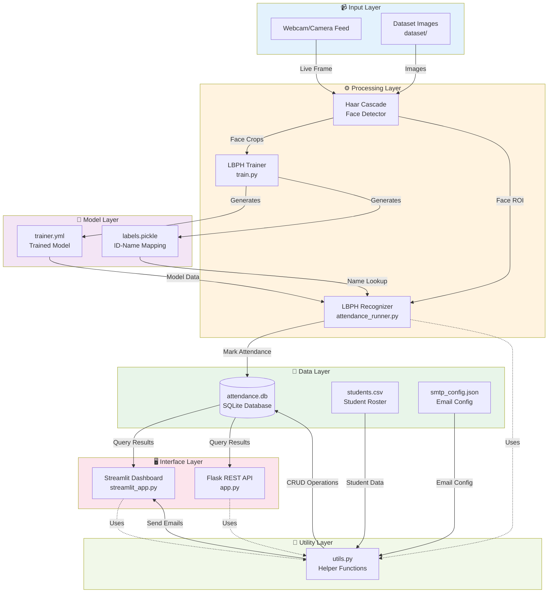

# 🎓 Attendance Management System

<div align="center">


**An intelligent, face recognition-based attendance management system built with Python, OpenCV, and modern web technologies.**

[Features](#-key-features) • [Installation](#-installation) • [Usage](#-usage) • [Architecture](#-system-architecture) • [API](#-api-documentation) • [Contributing](#-contributing)

---

## 📺 Demo Video

> See the Attendance Management System in action on [YouTube](https://youtu.be/9BWvfd2Gnkk)

<a href="https://youtu.be/9BWvfd2Gnkk" target="_blank">
  
</a>

---

</div>

## 📋 Table of Contents

- [About](#-about)
- [Key Features](#-key-features)
- [System Architecture](#-system-architecture)
- [Technology Stack](#-technology-stack)
- [Prerequisites](#-prerequisites)
- [Installation](#-installation)
- [Configuration](#-configuration)
- [Usage](#-usage)
  - [Training the Face Recognition Model](#1-training-the-face-recognition-model)
  - [Running Attendance Recognition](#2-running-attendance-recognition)
  - [Web Dashboard](#3-web-dashboard-streamlit)
  - [REST API](#4-rest-api-flask)
  - [Library Usage](#5-library-usage)
- [Project Structure](#-project-structure)
- [Database Schema](#-database-schema)
- [API Documentation](#-api-documentation)
- [Workflow Details](#-workflow-details)
- [Troubleshooting](#-troubleshooting)
- [Testing](#-testing)
- [Contributing](#-contributing)
- [Security Considerations](#-security-considerations)
- [License](#-license)
- [Maintainers](#-maintainers)
- [Acknowledgements](#-acknowledgements)

---

## 🌟 About

The **Attendance Management System** is a comprehensive, AI-powered solution for automated attendance tracking using facial recognition technology. Built with Python and leveraging OpenCV's LBPH (Local Binary Patterns Histograms) face recognition algorithm, this system provides a touchless, efficient, and accurate method for managing attendance in educational institutions, offices, or any organization requiring reliable attendance tracking.

The system combines computer vision, machine learning, and modern web technologies to deliver:

- **Real-time face detection and recognition** using webcam/camera feeds
- **Automated attendance marking** with duplicate prevention
- **Web-based administrative dashboard** for attendance management
- **RESTful API** for third-party integrations
- **Email notifications** for absent students/employees
- **Export capabilities** (CSV, Excel) for reporting

---

## ✨ Key Features

### 🎯 Core Features

- ✅ **Face Recognition-Based Attendance**: Automated attendance marking using LBPH face recognition
- ✅ **Real-time Processing**: Live camera feed processing for instant attendance marking
- ✅ **Idempotent Operations**: Prevents duplicate attendance entries for the same person on the same day
- ✅ **Multi-person Recognition**: Detects and recognizes multiple faces simultaneously
- ✅ **Confidence Scoring**: Adjustable confidence threshold for recognition accuracy

### 📊 Administrative Features

- 📈 **Interactive Dashboard**: Streamlit-based web interface for attendance management
- 📧 **Email Notifications**: Automatic absent notifications via SMTP
- 📁 **Data Export**: Export attendance records in CSV and Excel formats
- 📅 **Date-based Filtering**: View and manage attendance by specific dates
- 🔍 **Student Roster Management**: View and manage student information

### 🔧 Technical Features

- 🗄️ **SQLite Database**: Lightweight, serverless database for attendance records
- 🌐 **RESTful API**: Flask-based API for programmatic access
- 🎨 **Modern UI**: Clean, responsive web interface
- 🔐 **Secure Configuration**: Environment-based configuration management
- 📝 **Comprehensive Logging**: Detailed logs for debugging and monitoring

---

## 🏗️ System Architecture

The system follows a modular, layered architecture designed for extensibility and maintainability:


```mermaid
flowchart TB
    subgraph Input["📹 Input Layer"]
        CAM["Webcam/Camera Feed"]
        DATASET["Dataset Images<br/>dataset/"]
    end

    subgraph Processing["⚙️ Processing Layer"]
        DETECT["Haar Cascade<br/>Face Detector"]
        TRAIN["LBPH Trainer<br/>train.py"]
        RECOG["LBPH Recognizer<br/>attendance_runner.py"]
    end

    subgraph Model["🤖 Model Layer"]
        TRAINER["trainer.yml<br/>Trained Model"]
        LABELS["labels.pickle<br/>ID-Name Mapping"]
    end

    subgraph Data["💾 Data Layer"]
        DB[("attendance.db<br/>SQLite Database")]
        CSV["students.csv<br/>Student Roster"]
        SMTP["smtp_config.json<br/>Email Config"]
    end

    subgraph Interface["🖥️ Interface Layer"]
        UI["Streamlit Dashboard<br/>streamlit_app.py"]
        API["Flask REST API<br/>app.py"]
    end

    subgraph Utils["🔧 Utility Layer"]
        UTIL["utils.py<br/>Helper Functions"]
    end

    %% Training Flow
    DATASET -->|Images| DETECT
    DETECT -->|Face Crops| TRAIN
    TRAIN -->|Generates| TRAINER
    TRAIN -->|Generates| LABELS

    %% Recognition Flow
    CAM -->|Live Frame| DETECT
    DETECT -->|Face ROI| RECOG
    TRAINER -->|Model Data| RECOG
    LABELS -->|Name Lookup| RECOG
    RECOG -->|Mark Attendance| DB

    %% Management Flow
    CSV -->|Student Data| UTIL
    UTIL -->|CRUD Operations| DB
    DB -->|Query Results| UI
    DB -->|Query Results| API
    SMTP -->|Email Config| UTIL
    UTIL -->|Send Emails| UI

    %% Interactions
    UI -.->|Uses| UTIL
    API -.->|Uses| UTIL
    RECOG -.->|Uses| UTIL

    style Input fill:#e3f2fd
    style Processing fill:#fff3e0
    style Model fill:#f3e5f5
    style Data fill:#e8f5e9
    style Interface fill:#fce4ec
    style Utils fill:#f1f8e9
```

### 📐 Architecture Layers

1. **Input Layer** 📹
   - Webcam/camera feeds for live recognition
   - Dataset directory with training images

2. **Processing Layer** ⚙️
   - Haar Cascade for face detection
   - LBPH training algorithm
   - Face recognition engine

3. **Model Layer** 🤖
   - Trained LBPH model (trainer.yml)
   - ID-to-name mappings (labels.pickle)

4. **Data Layer** 💾
   - SQLite database for attendance records
   - CSV file for student roster
   - SMTP configuration for emails

5. **Interface Layer** 🖥️
   - Streamlit web dashboard
   - Flask REST API

6. **Utility Layer** 🔧
   - Shared helper functions
   - Database operations
   - Email services

> 📖 For detailed architecture documentation, see [ARCHITECTURE.md](ARCHITECTURE.md)

---

## 🛠️ Technology Stack

### Core Technologies

| Technology | Version | Purpose |
|------------|---------|---------|
| **Python** | 3.8+ | Primary programming language |
| **OpenCV (opencv-contrib-python)** | 4.8.0+ | Computer vision and face recognition |
| **NumPy** | Latest | Numerical computing |
| **SQLite** | Built-in | Database management |

### Web Frameworks

| Framework | Purpose |
|-----------|---------|
| **Flask** | REST API server |
| **Flask-CORS** | Cross-origin resource sharing |
| **Streamlit** | Interactive web dashboard |

### Data Processing

| Library | Purpose |
|---------|---------|
| **Pandas** | Data manipulation and analysis |
| **OpenPyXL** | Excel file operations |

### Additional Libraries

- **Pillow**: Image processing
- **APScheduler**: Job scheduling
- **python-dotenv**: Environment configuration
- **smtplib**: Email notifications

---

## 📋 Prerequisites

Before installing the system, ensure you have:

- **Python 3.8 or higher** installed
- **pip** package manager
- **Webcam/Camera** for live attendance (optional for API usage)
- **Git** for cloning the repository
- **Virtual environment** tool (recommended)

### System Requirements

- **OS**: Windows 10/11, Linux (Ubuntu 18.04+), macOS (10.14+)
- **RAM**: Minimum 4GB (8GB recommended)
- **Storage**: 500MB free space
- **Camera**: USB webcam or built-in camera (640x480 or higher)

---

## 📥 Installation

### Step 1: Clone the Repository

```bash
git clone https://github.com/KunjShah95/attendance-management-system.git
cd attendance-management-system
```

### Step 2: Create Virtual Environment (Recommended)

**Linux/macOS:**

```bash
python3 -m venv .venv
source .venv/bin/activate
```

**Windows (PowerShell):**

```powershell
python -m venv .venv
.\.venv\Scripts\Activate.ps1
```

**Windows (Command Prompt):**

```cmd
python -m venv .venv
.venv\Scripts\activate.bat
```

### Step 3: Install Dependencies

```bash
pip install --upgrade pip
pip install -r requirements.txt
```

### Step 4: Verify Installation

```bash
python -c "import cv2; print(f'OpenCV Version: {cv2.__version__}')"
python -c "import cv2; print(f'Face module available: {hasattr(cv2, \"face\")}')"
```

You should see:
```
OpenCV Version: 4.8.x.xx
Face module available: True
```

---

## ⚙️ Configuration

### 1. Database Configuration

The system uses SQLite by default. The database file (`attendance.db`) is created automatically.

```python
# Default database path
DB_PATH = "attendance.db"

# Custom database path
DB_PATH = "/path/to/custom/attendance.db"
```

### 2. Student Roster Configuration

Create or edit `students.csv` with the following format:

```csv
id,name,email
1,John Doe,john.doe@example.com
2,Jane Smith,jane.smith@example.com
3,Alice Johnson,alice.j@example.com
```

**CSV Format Requirements:**
- **Header row required**: `id,name,email`
- **id**: Unique integer identifier
- **name**: Student/employee full name
- **email**: Valid email address for notifications

### 3. SMTP Configuration (Optional)

For email notifications, create `smtp_config.json`:

```json
{
  "host": "smtp.gmail.com",
  "port": "587",
  "user": "your-email@gmail.com",
  "pass": "your-app-password",
  "use_tls": true
}
```

**Alternatively**, use environment variables:

Create `.env` file:
```env
SMTP_HOST=smtp.gmail.com
SMTP_PORT=587
SMTP_USER=your-email@gmail.com
SMTP_PASS=your-app-password
SMTP_USE_TLS=True
```

> ⚠️ **Security Note**: Never commit `smtp_config.json` or `.env` files with real credentials to version control!

### 4. Environment Variables

Create a `.env` file for configuration:

```env
# Database
DB_PATH=attendance.db

Rebuilt, polished, and developer-friendly documentation for the Attendance Management System. This README is written so contributors at any level (students, juniors, seniors, maintainers) can understand, run, and contribute to the project.

Table of Contents
- About
- Key Features
- Quick Start
- Requirements
- Installation
- Configuration
- Usage
  - CLI / Script usage
  - Library usage
- Architecture (high-level)
- Data model (summary)
- Tests
- Contributing
- Troubleshooting
- License
- Maintainers

About

A lightweight Attendance Management System implemented in Python. The project focuses on simple CSV-based imports, reliable SQLite persistence, and clear utilities for marking and querying attendance. The repository is intentionally small so it's easy to read, extend, and reuse in classrooms or small organizations.

Key Features
- Import student rosters from CSV
- Mark attendance to a local SQLite database
- Idempotent attendance marking (won't double-mark the same person for the same day)
- Small, well-tested utilities and clear boundaries so contributors can easily extend the system

Quick Start (seconds)
1. Clone the repo:
# Students CSV
STUDENTS_CSV=students.csv

# SMTP Configuration
SMTP_HOST=smtp.gmail.com
SMTP_PORT=587
SMTP_USER=your-email@gmail.com
SMTP_PASS=your-app-password
SMTP_USE_TLS=True

# Application Settings
VITE_APP_TITLE=Attendance Management System
```

---

## 🚀 Usage

### 1. Training the Face Recognition Model

Before recognizing faces, you must train the model with sample images.

#### Prepare Dataset

Create a directory structure:

```
dataset/
├── student_name_1/
│   ├── image1.jpg
│   ├── image2.jpg
│   └── image3.jpg
├── student_name_2/
│   ├── image1.jpg
│   └── image2.jpg
└── student_name_3/
    ├── image1.jpg
    ├── image2.jpg
    └── image3.jpg
```

**Guidelines:**
- Each subdirectory name should match the student name
- Use at least **10-15 images per person** for better accuracy
- Images should have clear, front-facing faces
- Vary lighting conditions and expressions
- Supported formats: JPG, JPEG, PNG

#### Train the Model

```bash
python train.py
```

**With custom paths:**
```bash
python train.py --dataset /path/to/dataset --model-dir /path/to/model
```

**Expected Output:**
```
[*] Gathering images...
[*] Training on 150 face samples from 10 people...
[+] Training complete. Model saved to: model/trainer.yml
[+] Labels saved to: model/labels.pickle
[*] Labels mapping (id -> name):
  1: john_doe
  2: jane_smith
  ...
```

### 2. Running Attendance Recognition

#### Using attendance_runner.py (Recommended)

```bash
python attendance_runner.py
```

**With options:**
```bash
python attendance_runner.py --cam 0 --threshold 70
```

**Parameters:**
- `--cam`: Camera index (default: 0)
- `--threshold`: Confidence threshold, lower = stricter (default: 70)

**Controls:**
- Press **'q'** to quit the camera feed

#### Using attendance.py (Alternative)

```bash
python attendance.py --model-dir model --db attendance.db --cam 0 --threshold 70
```

### 3. Web Dashboard (Streamlit)

Launch the interactive web dashboard:

```bash
streamlit run streamlit_app.py
```

Or on Windows:
```cmd
run_streamlit.bat
```

**Access the dashboard at**: `http://localhost:8501`

**Dashboard Features:**
- 📊 **Dashboard**: View today's attendance
- 👥 **Students**: Manage student roster
- 📋 **Attendance**: View/export attendance records
- 📝 **Reports**: Generate attendance reports
- ⚙️ **Settings**: Configure SMTP and system settings
- 📹 **Live Recognition**: Real-time face recognition with camera

### 4. REST API (Flask)

Start the Flask API server:

```bash
python app.py
```

**API runs at**: `http://localhost:5000`

**Available Endpoints:**
- `GET /api/attendance`: Retrieve attendance records
- `GET /api/students`: Get student roster
- `POST /api/send_absent_emails`: Send absence notifications
- `GET /api/export_csv`: Export attendance data

### 5. Library Usage

Use the system as a Python library in your scripts:

```python
from utils import ensure_db, load_students, mark_attendance_db, get_attendance

# Initialize database
ensure_db('attendance.db')

# Load students from CSV
students = load_students('students.csv')
print(f"Loaded {len(students)} students")

# Mark attendance manually
marked = mark_attendance_db(1, 'John Doe', db_path='attendance.db')
if marked:
    print("Attendance marked successfully")
else:
    print("Already marked or error occurred")

# Retrieve attendance for today
from datetime import date
attendance = get_attendance(db_path='attendance.db', date_str=date.today().isoformat())
for record in attendance:
    print(f"ID: {record[0]}, Name: {record[1]}, Date: {record[2]}, Time: {record[3]}")
```

---

## 📁 Project Structure

```
attendance-management-system/
│
├── 📄 README.md                 # This file
├── 📄 ARCHITECTURE.md           # Detailed architecture documentation
├── 📄 CONTRIBUTING.md           # Contribution guidelines
├── 📄 LICENSE                   # MIT License
├── 📄 requirements.txt          # Python dependencies
├── 📄 .env.example              # Environment variables template
├── 📄 .gitignore                # Git ignore rules
│
├── 🗂️ dataset/                  # Training images (one folder per person)
│   ├── john_doe/
│   ├── jane_smith/
│   └── ...
│
├── 🗂️ model/                    # Trained models (generated)
│   ├── trainer.yml             # LBPH trained model
│   └── labels.pickle           # ID to name mapping
│
├── 🗂️ docs/                     # Documentation
│   └── ARCHITECTURE.md
│
├── 🗂️ tests/                    # Unit tests
│   └── test_utils.py
│
├── 📊 attendance.db             # SQLite database (generated)
├── 📄 students.csv              # Student roster
├── 📄 smtp_config.json          # SMTP configuration (git-ignored)
│
├── 🐍 train.py                  # Model training script
├── 🐍 attendance.py             # Attendance recognition (alternative)
├── 🐍 attendance_runner.py     # Attendance recognition (main)
├── 🐍 utils.py                  # Utility functions
├── 🐍 streamlit_app.py          # Streamlit dashboard
├── 🐍 streamlit_utils.py        # Streamlit helper functions
├── 🐍 app.py                    # Flask REST API
│
├── 🌐 architecture.html         # Interactive architecture diagram
└── 🦇 run_streamlit.bat         # Windows batch script
```

---

## 🗄️ Database Schema

### Attendance Table

```sql
CREATE TABLE IF NOT EXISTS attendance (
    id INTEGER PRIMARY KEY AUTOINCREMENT,
    student_id INTEGER NOT NULL,
    name TEXT NOT NULL,
    date DATE NOT NULL,
    time TEXT NOT NULL,
    UNIQUE(student_id, date)
);
```

**Columns:**
- **id**: Auto-incrementing primary key
- **student_id**: Student identifier (references students CSV)
- **name**: Student name
- **date**: Attendance date (YYYY-MM-DD format)
- **time**: Attendance time (HH:MM:SS format)

**Constraints:**
- Unique constraint on `(student_id, date)` prevents duplicate entries

### Data Model

```
students.csv (External)
├─ id (INTEGER)
├─ name (TEXT)
└─ email (TEXT)

attendance.db
└─ attendance table
   ├─ id (INTEGER PRIMARY KEY)
   ├─ student_id (INTEGER) -> references students.csv:id
   ├─ name (TEXT)
   ├─ date (DATE)
   └─ time (TEXT)
```

---

## 🔌 API Documentation

### Base URL
```
http://localhost:5000
```

### Endpoints

#### 1. Get Attendance Records

```http
GET /api/attendance?date=YYYY-MM-DD
```

**Query Parameters:**
- `date` (optional): Filter by specific date (format: YYYY-MM-DD)

**Response:**
```json
[
  {
    "id": 1,
    "name": "John Doe",
    "date": "2024-01-15",
    "time": "09:30:45"
  },
  {
    "id": 2,
    "name": "Jane Smith",
    "date": "2024-01-15",
    "time": "09:31:22"
  }
]
```

#### 2. Get Students

```http
GET /api/students
```

**Response:**

```json
[
  {
    "id": 1,
    "name": "John Doe",
    "email": "john.doe@example.com"
  },
  {
    "id": 2,
    "name": "Jane Smith",
    "email": "jane.smith@example.com"
  }
]
```

#### 3. Send Absent Emails

```http
POST /api/send_absent_emails
Content-Type: application/json
```

**Request Body:**
```json
{
  "date": "2024-01-15",
  "smtp": {
    "host": "smtp.gmail.com",
    "port": "587",
    "user": "your-email@gmail.com",
    "pass": "your-password",
    "use_tls": true
  }
}
```

**Response:**
```json
{
  "sent": 5
}
```

#### 4. Export Attendance

```http
GET /api/export_csv?date=YYYY-MM-DD&format=csv
```

**Query Parameters:**
- `date` (optional): Filter by date
- `format`: `csv` or `xlsx` (default: csv)

**Response:** File download

---

## 🔄 Workflow Details

### Training Workflow

```
1. Prepare Dataset
   ↓
2. Organize images in dataset/ directory
   ├─ One folder per person
   └─ Multiple images per folder
   ↓
3. Run train.py
   ↓
4. Haar Cascade detects faces
   ↓
5. LBPH algorithm trains on face samples
   ↓
6. Generate model files
   ├─ trainer.yml (model data)
   └─ labels.pickle (ID mappings)
```

### Recognition Workflow

```
1. Start camera feed
   ↓
2. Capture frame
   ↓
3. Convert to grayscale
   ↓
4. Haar Cascade detects faces
   ↓
5. Extract face ROI
   ↓
6. LBPH recognizer predicts identity
   ↓
7. Calculate confidence score
   ↓
8. Check against threshold
   ↓
9. If match found:
   ├─ Lookup name from labels
   ├─ Mark attendance in database
   └─ Display on screen
```

### Management Workflow

```
1. User accesses UI or API
   ↓
2. Request processed
   ↓
3. Database queried
   ↓
4. Data formatted
   ↓
5. Response returned
   ├─ JSON (API)
   └─ HTML (Dashboard)
```

---

## 🐛 Troubleshooting

### Common Issues

#### 1. OpenCV Face Module Not Found

**Error:**
```
AttributeError: module 'cv2' has no attribute 'face'
```

**Solution:**
```bash
pip uninstall opencv-python opencv-contrib-python
pip install opencv-contrib-python==4.8.0.76
```

#### 2. Camera Not Working

**Error:**
```
Cannot open camera 0
```

**Solutions:**
- Check camera permissions (especially on Linux/macOS)
- Try different camera index: `--cam 1` or `--cam 2`
- Verify camera works with other applications
- On Linux: `sudo usermod -a -G video $USER` (logout and login)

#### 3. No Faces Detected

**Solutions:**
- Ensure adequate lighting
- Position face clearly in camera view
- Adjust detection parameters:
  - Lower `minNeighbors` (default: 5)
  - Adjust `scaleFactor` (default: 1.1)
  - Reduce `minSize` (default: 60x60)

```python
faces = detector.detectMultiScale(
    gray,
    scaleFactor=1.05,  # More sensitive
    minNeighbors=3,    # Lower threshold
    minSize=(30, 30)   # Smaller minimum
)
```

#### 4. Low Recognition Accuracy

**Solutions:**
- Add more training images (15-20 per person)
- Vary lighting and angles in training images
- Adjust confidence threshold:
  - Lower threshold = stricter matching
  - Higher threshold = more lenient
- Retrain model with better quality images

#### 5. Database Permission Error

**Error:**
```
sqlite3.OperationalError: unable to open database file
```

**Solutions:**
- Check file permissions: `chmod 666 attendance.db`
- Verify directory write permissions
- Use absolute path for database file

#### 6. SMTP Email Errors

**Solutions:**
- Enable "Less secure app access" for Gmail (deprecated)
- Use **App Passwords** for Gmail (recommended)
- Verify SMTP settings are correct
- Check firewall/network restrictions
- Test SMTP connection separately

#### 7. Streamlit Port Already in Use

**Error:**
```
Address already in use
```

**Solution:**
```bash
streamlit run streamlit_app.py --server.port 8502
```

---

## 🧪 Testing

### Run All Tests

```bash
python -m pytest tests/ -v
```

### Run Specific Test

```bash
python -m pytest tests/test_utils.py -v
```

### Test Coverage

The test suite covers:
- ✅ CSV student loading
- ✅ Database initialization
- ✅ Attendance marking (idempotent)
- ✅ Duplicate prevention
- ✅ Date-based queries

### Manual Testing

#### Test Face Detection
```bash
python test_detect_params.py
```

#### Test Recognition
```bash
python test_recognize.py
```

---

## 🤝 Contributing

We welcome contributions from developers of all skill levels!

### How to Contribute

1. **Fork** the repository
2. **Clone** your fork:
   ```bash
   git clone https://github.com/KunjShah95/attendance-management-system.git
   cd attendance-management-system
   git clone https://github.com/YOUR_USERNAME/attendance-management-system.git
   ```
2. Create a virtual environment and install dependencies (recommended):
3. **Create** a feature branch:
   ```bash
   python -m venv .venv
   source .venv/bin/activate   # macOS/Linux
   .\.venv\Scripts\activate  # Windows (PowerShell)
   pip install -r requirements.txt
   git checkout -b feature/your-feature-name
   ```
3. Initialize the database and run a short demo:
4. **Make** your changes
5. **Test** your changes:
   ```bash
   python -c "from utils import ensure_db, load_students, mark_attendance_db; ensure_db('attendance.db'); print('DB ready')"
   python -m pytest tests/
   ```
6. **Commit** with clear messages:
   ```bash
   git commit -m "Add: New feature description"
   ```
7. **Push** to your fork:
   ```bash
   git push origin feature/your-feature-name
   ```
8. **Open** a Pull Request

### Contribution Guidelines

- ✅ Write clean, readable code
- ✅ Follow PEP 8 style guidelines
- ✅ Add tests for new features
- ✅ Update documentation
- ✅ Keep changes focused and atomic
- ✅ Write descriptive commit messages

### Code Style

```bash
# Format code with Black
black *.py

# Check with Flake8
flake8 *.py --max-line-length=100
```

For detailed guidelines, see [CONTRIBUTING.md](CONTRIBUTING.md)

---

## 🔒 Security Considerations

### Data Privacy
- 🔐 Facial data is **sensitive biometric information**
- 📜 Ensure compliance with **GDPR, CCPA, and local privacy laws**
- ✅ Obtain **explicit consent** before collecting facial data
- 🗓️ Implement **data retention policies**
- 🔒 Consider **encryption** for production databases

### Credential Security
- ❌ **Never commit** credentials to version control
- ✅ Use **environment variables** or `.env` files
- ✅ Use **App Passwords** for email services
- ✅ Enable **TLS/SSL** for SMTP connections
- ✅ Implement **access controls** and authentication
- ✅ Rotate credentials regularly

### Database Security
- 🔐 SQLite is file-based: **protect file permissions**
- 🔒 Consider **encryption at rest** for production
- 💾 Implement **regular backups**
- 🚫 Restrict database access to authorized users only

### Best Practices
- Keep dependencies updated: `pip install --upgrade -r requirements.txt`
- Regular security audits
- Input validation and sanitization
- Secure communication channels (HTTPS)

---

## 📊 Performance Considerations

### Optimization Tips

1. **Face Detection Optimization**

   ```python
   # Reduce frame processing rate
   if frame_count % 3 == 0:  # Process every 3rd frame
       faces = detector.detectMultiScale(gray, ...)
   ```

2. **Database Optimization**

   ```python
   # Create index for faster queries
   cursor.execute("CREATE INDEX IF NOT EXISTS idx_date ON attendance(date)")
   ```

Requirements
- Python 3.8+
- SQLite (bundled with Python)
- pip
3. **Memory Management**
   - Close database connections after use
   - Release camera resources properly
   - Limit image resolution for processing

### Scalability Notes

**Current Limitations:**

- Single-threaded face recognition
- Local SQLite database
- Single camera support
- No distributed processing

**Future Improvements:**

- Multi-camera support
- PostgreSQL/MySQL for larger deployments
- Redis caching layer
- Load balancing for API
- Distributed recognition nodes
- Batch processing capabilities

---

## 🎯 Use Cases

### Educational Institutions

- **Classroom Attendance**: Automated student attendance tracking
- **Exam Halls**: Verification of student identity
- **Library Access**: Track library usage
- **Lab Sessions**: Monitor lab attendance

### Corporate Environments

- **Office Entry**: Employee check-in/check-out
- **Meeting Rooms**: Track meeting attendance
- **Shift Management**: Monitor shift timings
- **Visitor Management**: Log visitor entries

### Events

- **Conferences**: Attendee tracking
- **Workshops**: Participant management
- **Seminars**: Attendance certification
- **Training Programs**: Completion tracking

---

## 📈 Future Roadmap

### Planned Features

- [ ] **Multi-camera Support**: Simultaneous recognition from multiple cameras
- [ ] **Mobile App**: iOS and Android applications
- [ ] **Advanced Analytics**: Attendance trends and insights
- [ ] **Face Mask Detection**: Recognition with face masks
- [ ] **Temperature Screening**: Integrate thermal cameras
- [ ] **Cloud Integration**: AWS/Azure/GCP deployment
- [ ] **Real-time Notifications**: Push notifications for attendance
- [ ] **Biometric Integration**: Combine with fingerprint/RFID
- [ ] **Advanced Reporting**: Customizable reports and dashboards
- [ ] **Multi-language Support**: Internationalization (i18n)
- [ ] **Access Control**: Role-based permissions
- [ ] **Audit Logs**: Complete activity logging
- [ ] **API Rate Limiting**: Prevent abuse
- [ ] **WebSocket Support**: Real-time updates

Installation
Detailed install steps:

- Recommended: use a virtual environment
- Install dependencies if requirements.txt exists: `pip install -r requirements.txt`
---

Configuration

- Database path: by default, utilities use `attendance.db` in the repository root. You can pass a different path to functions that accept `db_path`.
- Students CSV format: The loader expects a CSV with at least the following columns (header row): `id,name,other(optional)`

## 🔧 Advanced Configuration

Usage
### Custom Cascade Classifier

CLI / Script usage

- The repo is designed to be imported as a small library or executed via small scripts. Example script usage (example/script.py):
Use custom Haar Cascade files:

```python
from utils import ensure_db, load_students, mark_attendance_db
# In train.py or attendance_runner.py
CASCADE_PATH = "path/to/custom/cascade.xml"
detector = cv2.CascadeClassifier(CASCADE_PATH)
```

ensure_db('attendance.db')
students = load_students('students.csv')
for s in students[:5]:
    mark_attendance_db(s['id'], s.get('name','Unknown'), db_path='attendance.db')

### Adjust LBPH Parameters

Fine-tune the LBPH recognizer:

```python
recognizer = cv2.face.LBPHFaceRecognizer_create(
    radius=1,        # Radius for LBP (default: 1)
    neighbors=8,     # Number of neighbors (default: 8)
    grid_x=8,        # Grid cells in X (default: 8)
    grid_y=8,        # Grid cells in Y (default: 8)
    threshold=70.0   # Recognition threshold (default: DBL_MAX)
)
```

### Database Customization

Use different database backends:

```python
# PostgreSQL example
import psycopg2

conn = psycopg2.connect(
    host="localhost",
    database="attendance",
    user="your_username",
    password="your_password"
)
```

Library usage (importing core utilities)
---

## 📚 Additional Resources

### Documentation

- 📖 [Architecture Guide](ARCHITECTURE.md) - Detailed system architecture
- 📖 [Diagram Guide](DIAGRAM_GUIDE.md) - Architecture visualization
- 📖 [Contributing Guidelines](CONTRIBUTING.md) - How to contribute
- 🌐 [Interactive Diagram](architecture.html) - Open in browser

### External Resources

- [OpenCV Documentation](https://docs.opencv.org/)
- [LBPH Face Recognition](https://docs.opencv.org/4.x/df/d25/classcv_1_1face_1_1LBPHFaceRecognizer.html)
- [Flask Documentation](https://flask.palletsprojects.com/)
- [Streamlit Documentation](https://docs.streamlit.io/)
- [SQLite Documentation](https://www.sqlite.org/docs.html)

### Tutorials

- [Face Recognition Tutorial](https://www.pyimagesearch.com/2018/09/24/opencv-face-recognition/)
- [LBPH Algorithm Explained](https://towardsdatascience.com/face-recognition-how-lbph-works-90ec258c3d6b)
- [Building REST APIs with Flask](https://flask-restful.readthedocs.io/)

---

## ❓ FAQ

### General Questions

**Q: Can this system work offline?**  
A: Yes! The core attendance recognition works completely offline. Only email notifications require internet.

**Q: How many people can be recognized?**  
A: The system can handle hundreds of people. Performance depends on training data quality and hardware.

**Q: What accuracy can I expect?**  
A: With good training data (15-20 images per person), expect 85-95% accuracy in controlled lighting.

**Q: Can it recognize multiple faces simultaneously?**  
A: Yes, the system detects and recognizes all visible faces in the camera frame.

### Technical Questions

- load_students(csv_path) -> list[dict]
- ensure_db(db_path) -> creates DB and tables if missing
- mark_attendance_db(id, name, db_path) -> bool (True if new mark, False if already marked or error)
**Q: Why LBPH instead of deep learning?**  
A: LBPH is lightweight, fast, and works well without GPU. Suitable for edge devices and real-time processing.

Example:
**Q: Can I use a different database?**  
A: Yes, you can modify the database layer in `utils.py` to support PostgreSQL, MySQL, or MongoDB.

**Q: Does it work with IP cameras?**  
A: Yes, use the RTSP stream URL as the camera source:

```python
from utils import load_students, ensure_db, mark_attendance_db
cap = cv2.VideoCapture("rtsp://username:password@ip:port/stream")
```

ensure_db('attendance.db')
students = load_students('students.csv')
print('Loaded', len(students), 'students')
mark_attendance_db(1, 'Alice Example', db_path='attendance.db')
**Q: How do I improve recognition accuracy?**  
A: 

1. Use more training images (15-20 per person)
2. Vary lighting and angles
3. Ensure high-quality images
4. Adjust confidence threshold
5. Use consistent background

### Deployment Questions

**Q: Can I deploy this on a Raspberry Pi?**  
A: Yes! Install OpenCV and dependencies. May need performance tuning for smooth operation.

**Q: How do I deploy to production?**  
A: Use production WSGI server (Gunicorn), reverse proxy (Nginx), and secure the application with HTTPS.

**Q: Can I integrate with existing systems?**  
A: Yes, use the REST API to integrate with any system that can make HTTP requests.

---

## 🐞 Known Issues

1. **Performance on Low-End Hardware**: May be slow on systems with <4GB RAM
2. **Poor Lighting**: Recognition accuracy drops significantly in dim lighting
3. **Face Angles**: Side profiles may not be recognized accurately
4. **Multiple Faces**: Processing speed decreases with many simultaneous faces
5. **Database Locking**: Concurrent writes may cause SQLite locking issues

### Workarounds

- Use adequate lighting (500+ lux recommended)
- Position camera for frontal face capture
- Limit camera to cover smaller areas
- Consider PostgreSQL for high-concurrency scenarios

---

## 📞 Support

### Getting Help

- 📧 **Email**: Open an issue on GitHub
- 💬 **Discussions**: [GitHub Discussions](https://github.com/KunjShah95/attendance-management-system/discussions)
- 🐛 **Bug Reports**: [GitHub Issues](https://github.com/KunjShah95/attendance-management-system/issues)
- 📖 **Documentation**: Read [ARCHITECTURE.md](ARCHITECTURE.md) and this README

### Reporting Issues

When reporting issues, please include:
1. **System information** (OS, Python version, OpenCV version)
2. **Error messages** (full stack trace)
3. **Steps to reproduce** the issue
4. **Expected vs actual behavior**
5. **Screenshots** if applicable

**Template:**
```markdown
**Environment:**
- OS: Ubuntu 22.04
- Python: 3.10.12
- OpenCV: 4.8.0

**Issue:**
Description of the problem...

**Steps to Reproduce:**
1. Step 1
2. Step 2
3. Step 3

**Error Message:**
```
Paste error message here
```

Architecture (high-level)
See docs/ARCHITECTURE.puml (PlantUML) for a visual diagram and docs/ARCHITECTURE.md for an explanation. High-level components:
- Import layer (CSV loader)
- Core services (attendance service, student service)
- Persistence (SQLite)
- Tests and CI
**Expected Behavior:**
What you expected to happen...

Data model (summary)
A simple attendance schema is recommended:
- students (id INTEGER PRIMARY KEY, name TEXT, extra JSON/NULL)
- attendance (id INTEGER PRIMARY KEY AUTOINCREMENT, student_id INTEGER, date DATE, marked_at DATETIME, UNIQUE(student_id, date))
**Actual Behavior:**
What actually happened...
```

Tests
Run the existing tests with pytest:
---

```bash
python -m pytest -q
## 📜 License

This project is licensed under the **MIT License** - see the [LICENSE](LICENSE) file for details.

```
