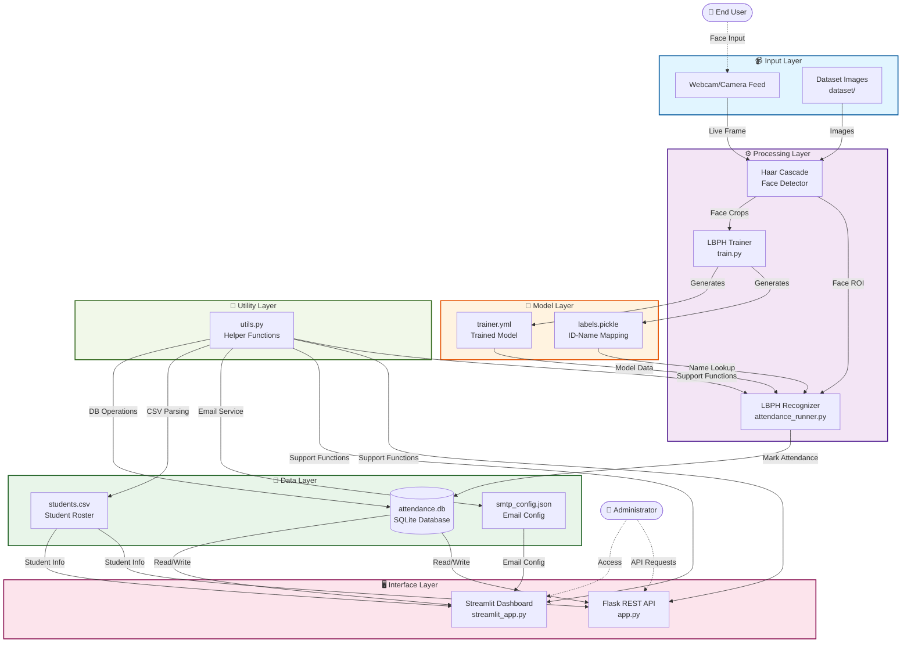

<div align="center">
  <h1>🎓 Attendance Management System</h1>
  **An Intelligent Face Recognition-Based Attendance Tracking Solution**
  
  [](https://www.python.org/)
  [](https://opencv.org/)
  [](https://streamlit.io/)
  [](https://flask.palletsprojects.com/)
  [](LICENSE)
  
  <p>A comprehensive, production-ready attendance management system utilizing computer vision and machine learning for automated student attendance tracking.</p>
</div>

---

## 📋 Table of Contents

- [Overview](#-overview)
- [Key Features](#-key-features)
- [System Architecture](#-system-architecture)
- [Technology Stack](#-technology-stack)
- [Project Structure](#-project-structure)
- [Prerequisites](#-prerequisites)
- [Installation](#-installation)
- [Configuration](#-configuration)
- [Usage Guide](#-usage-guide)
  - [Training the Model](#1-training-the-model)
  - [Live Attendance Recognition](#2-live-attendance-recognition)
  - [Admin Dashboard](#3-admin-dashboard-streamlit)
  - [REST API](#4-rest-api-flask)
- [Dataset Guidelines](#-dataset-guidelines)
- [Database Schema](#-database-schema)
- [Email Notifications](#-email-notifications)
- [API Documentation](#-api-documentation)
- [Troubleshooting](#-troubleshooting)
- [Contributing](#-contributing)
- [Roadmap](#-roadmap)
- [License](#-license)
- [Acknowledgments](#-acknowledgments)

---

## 🌟 Overview

The **Attendance Management System** is an intelligent, self-contained solution for automated attendance tracking using facial recognition technology. Built with OpenCV's LBPH (Local Binary Patterns Histograms) algorithm, this system provides a seamless way to manage student attendance without manual intervention.

### Why This Project?

Traditional attendance systems are time-consuming, prone to proxy attendance, and lack automation. This system addresses these challenges by:

- **Automating attendance marking** through facial recognition
- **Preventing proxy attendance** with biometric verification
- **Providing real-time insights** through an intuitive admin dashboard
- **Enabling integration** via REST API endpoints
- **Supporting email notifications** for absent students

Perfect for educational institutions, training centers, corporate environments, and any organization requiring reliable attendance tracking.

---

## ✨ Key Features

### Core Functionality
- 🎯 **Face Detection & Recognition** - Real-time face detection using Haar Cascades and recognition via LBPH algorithm
- 📸 **Live Camera Integration** - Continuous attendance monitoring through webcam
- 🗄️ **SQLite Database** - Lightweight, serverless database for attendance records
- 🎨 **Interactive Admin Dashboard** - Modern Streamlit-based UI for attendance management
- 🔌 **RESTful API** - Flask-based API for third-party integrations
- 📧 **Email Notifications** - Automated absent student notifications via SMTP
- 📊 **Export Capabilities** - Export attendance data to CSV/Excel formats
- 🔐 **Duplicate Prevention** - Ensures one attendance entry per student per day

### Advanced Features
- ⚙️ **Configurable Confidence Threshold** - Adjustable face recognition accuracy
- 📅 **Date-based Filtering** - View attendance for specific dates
- 👥 **Student Roster Management** - CSV-based student database
- 🔄 **Real-time Updates** - Live attendance marking and dashboard updates
- 🎭 **Multi-face Detection** - Simultaneous recognition of multiple faces
- 🛠️ **Diagnostic Tools** - Built-in system health checks

---

## 🏗️ System Architecture

### Architecture Diagram

The following Mermaid diagram illustrates the complete system architecture, showing all components and their interactions:


```mermaid
flowchart TB
    subgraph Input["📹 Input Layer"]
        CAM["Webcam/Camera Feed"]
        DATASET["Dataset Images<br/>dataset/"]
    end

    subgraph Processing["⚙️ Processing Layer"]
        DETECT["Haar Cascade<br/>Face Detector"]
        TRAIN["LBPH Trainer<br/>train.py"]
        RECOG["LBPH Recognizer<br/>attendance_runner.py"]
    end

    subgraph Model["🤖 Model Layer"]
        TRAINER["trainer.yml<br/>Trained Model"]
        LABELS["labels.pickle<br/>ID-Name Mapping"]
    end

    subgraph Data["💾 Data Layer"]
        DB[("attendance.db<br/>SQLite Database")]
        CSV["students.csv<br/>Student Roster"]
        SMTP["smtp_config.json<br/>Email Config"]
    end

    subgraph Interface["🖥️ Interface Layer"]
        UI["Streamlit Dashboard<br/>streamlit_app.py"]
        API["Flask REST API<br/>app.py"]
    end

    subgraph Utils["🔧 Utility Layer"]
        UTIL["utils.py<br/>Helper Functions"]
    end

    %% Training Flow
    DATASET -->|Images| DETECT
    DETECT -->|Face Crops| TRAIN
    TRAIN -->|Generates| TRAINER
    TRAIN -->|Generates| LABELS

    %% Recognition Flow
    CAM -->|Live Frame| DETECT
    DETECT -->|Face ROI| RECOG
    TRAINER -->|Model Data| RECOG
    LABELS -->|Name Lookup| RECOG
    RECOG -->|Mark Attendance| DB

    %% Data Management
    CSV -->|Student Info| UI
    CSV -->|Student Info| API
    DB -->|Read/Write| UI
    DB -->|Read/Write| API
    SMTP -->|Email Config| UI

    %% Utility Layer
    UTIL -->|DB Operations| DB
    UTIL -->|CSV Parsing| CSV
    UTIL -->|Email Service| SMTP
    UTIL -->|Support Functions| UI
    UTIL -->|Support Functions| API
    UTIL -->|Support Functions| RECOG

    %% User Interactions
    USER(["👤 Administrator"]) -.->|Access| UI
    USER -.->|API Requests| API
    ADMIN(["👤 End User"]) -.->|Face Input| CAM

    style Input fill:#e1f5ff,stroke:#01579b,stroke-width:2px
    style Processing fill:#f3e5f5,stroke:#4a148c,stroke-width:2px
    style Model fill:#fff3e0,stroke:#e65100,stroke-width:2px
    style Data fill:#e8f5e9,stroke:#1b5e20,stroke-width:2px
    style Interface fill:#fce4ec,stroke:#880e4f,stroke-width:2px
    style Utils fill:#f1f8e9,stroke:#33691e,stroke-width:2px
```

> **📊 Can't see the diagram?**
>
> - **Option 1**: View on GitHub (Mermaid is natively supported)
> - **Option 2**: Copy the diagram code and paste into [Mermaid Live Editor](https://mermaid.live/)
> - **Option 3**: Use the text-based diagram below as an alternative

### Alternative: Text-Based Architecture View

```
┌─────────────────────────────────────────────────────────────────────┐
│                    ATTENDANCE MANAGEMENT SYSTEM                      │
└─────────────────────────────────────────────────────────────────────┘

📹 INPUT LAYER
├── Webcam/Camera Feed ──────────┐
└── Dataset Images (dataset/)────┤
                                 │
                                 ↓
⚙️ PROCESSING LAYER              │
├── Haar Cascade Detector ←──────┘
├── LBPH Trainer (train.py)
└── LBPH Recognizer (attendance_runner.py)
        │                    │
        ↓                    ↓
🤖 MODEL LAYER          🎯 RECOGNITION
├── trainer.yml              │
└── labels.pickle            │
        │                    │
        └────────┬───────────┘
                 ↓
💾 DATA LAYER
├── attendance.db (SQLite) ←─────┐
├── students.csv                 │
└── smtp_config.json             │
        │                        │
        ↓                        │
🖥️ INTERFACE LAYER              │
├── Streamlit Dashboard ─────────┤
└── Flask REST API ──────────────┘
        │
        ↓
🔧 UTILITY LAYER
└── utils.py (Helper Functions)

FLOW:
1. Training: Dataset → Detector → Trainer → Model Files
2. Recognition: Camera → Detector → Recognizer → Database
3. Management: Database ← → UI/API ← → Administrator
```

### Data Flow Explanation

1. **Training Phase** (One-time setup)
   - Images from `dataset/` folder are processed by Haar Cascade detector
   - Detected faces are used to train the LBPH recognizer
   - Trained model (`trainer.yml`) and label mappings (`labels.pickle`) are generated

2. **Recognition Phase** (Real-time)
   - Live camera feed captures frames
   - Haar Cascade detects faces in each frame
   - LBPH recognizer matches detected faces against trained model
   - Successful matches trigger attendance marking in the database

3. **Management Phase** (Admin operations)
   - Streamlit UI and Flask API provide interfaces for data access
   - Attendance records are retrieved from SQLite database
   - Student roster is loaded from CSV file
   - Email notifications are sent for absent students

### Component Interaction

| Component | Purpose | Dependencies |
|-----------|---------|--------------|
| **train.py** | Model training | OpenCV, NumPy, Dataset images |
| **attendance_runner.py** | Live recognition | Trained model, Camera, SQLite |
| **streamlit_app.py** | Admin dashboard | Database, Student CSV, SMTP config |
| **app.py** | REST API server | Database, Student CSV, Flask |
| **utils.py** | Utility functions | All components use this |

---

## 🛠️ Technology Stack

### Core Technologies

| Category | Technology | Version | Purpose |
|----------|-----------|---------|---------|
| **Language** | Python | 3.10+ | Primary programming language |
| **Computer Vision** | OpenCV (contrib) | 4.8.0+ | Face detection & recognition |
| **Web Framework** | Streamlit | Latest | Admin dashboard UI |
| **API Framework** | Flask | Latest | REST API endpoints |
| **Database** | SQLite | 3.x | Attendance storage |
| **Data Processing** | Pandas | Latest | Data manipulation |
| **Numerical Computing** | NumPy | Latest | Array operations |

### Key Python Libraries

```plaintext
opencv-contrib-python >= 4.8.0  # Face recognition module
numpy                            # Numerical operations
pandas                           # Data manipulation
Pillow                          # Image processing
Flask                           # REST API framework
flask-cors                      # CORS support
APScheduler                     # Task scheduling
python-dotenv                   # Environment variables
streamlit                       # Web UI framework
streamlit-aggrid                # Enhanced data grids
requests                        # HTTP requests
openpyxl                        # Excel file support
```

### Algorithms & Models

- **Face Detection**: Haar Cascade Classifier (frontal face)
- **Face Recognition**: LBPH (Local Binary Patterns Histograms)
- **Confidence Metric**: Distance-based matching (lower = better)

---

## 📁 Project Structure

```plaintext
attendance-management-system/
│
├── 📄 Core Application Files
│   ├── app.py                    # Flask REST API server
│   ├── streamlit_app.py          # Streamlit admin dashboard
│   ├── attendance_runner.py      # Live recognition engine
│   ├── train.py                  # Model training script
│   ├── utils.py                  # Utility functions & helpers
│   └── streamlit_utils.py        # Streamlit-specific utilities
│
├── 📊 Data Files
│   ├── attendance.db             # SQLite attendance database
│   ├── students.csv              # Student roster (id, name, email)
│   ├── smtp_config.json          # SMTP configuration (git-ignored)
│   └── .env                      # Environment variables (optional)
│
├── 🤖 Model Files
│   └── model/
│       ├── trainer.yml           # Trained LBPH model
│       └── labels.pickle         # ID-to-name mappings
│
├── 📸 Dataset
│   └── dataset/
│       ├── student1/             # Folder per student
│       │   ├── image1.jpg
│       │   ├── image2.jpg
│       │   └── ...
│       ├── student2/
│       └── ...
│
├── 🧪 Testing
│   ├── tests/
│   │   └── test_utils.py
│   ├── test_detect_params.py
│   ├── test_imports.py
│   ├── test_predict.py
│   ├── test_recognize.py
│   └── test_recognize_known.py
│
├── 📚 Documentation
│   ├── README.md                 # This file
│   ├── CONTRIBUTING.md           # Contribution guidelines
│   └── LICENSE                   # MIT License
│
├── ⚙️ Configuration
│   ├── requirements.txt          # Python dependencies
│   ├── run_streamlit.bat         # Windows batch script
│   └── .gitignore               # Git ignore rules
│
└── 🗑️ Cache & Backups
    ├── __pycache__/
    ├── attendance.db.bak
    └── students.csv.bak
```

### File Descriptions

**Core Scripts:**
- `app.py` - Flask API exposing endpoints for attendance, students, and export
- `streamlit_app.py` - Web-based admin interface with dashboard, reports, and settings
- `attendance_runner.py` - Real-time face recognition and attendance marking
- `train.py` - Trains LBPH model from dataset images
- `utils.py` - Database operations, CSV handling, email sending, label management

**Data Files:**
- `attendance.db` - SQLite database storing attendance records
- `students.csv` - CSV file with student details (id, name, email)
- `smtp_config.json` - SMTP server configuration for email notifications

**Model Files:**
- `trainer.yml` - Binary file containing trained LBPH face recognizer model
- `labels.pickle` - Pickle file mapping numeric IDs to student names

---

## 📋 Prerequisites

### System Requirements

- **Operating System**: Windows 10/11, macOS 10.14+, or Linux (Ubuntu 18.04+)
- **Python**: Version 3.10 or higher
- **Webcam**: Built-in or external USB camera
- **RAM**: Minimum 4GB (8GB recommended)
- **Storage**: At least 500MB free space

### Software Dependencies

- Python 3.10+ with pip
- Virtual environment support (venv)
- Git (for cloning repository)
- Text editor or IDE (VS Code recommended)

### Hardware Requirements

- Camera with minimum 720p resolution
- Adequate lighting for face detection
- Processor: Intel i3 or equivalent (i5+ recommended)

---

## 🚀 Installation

### Step 1: Clone the Repository

```bash
# Using HTTPS
git clone https://github.com/KunjShah95/attendance-management-system.git

# Or using SSH
git clone git@github.com:KunjShah95/attendance-management-system.git

# Navigate to project directory
cd attendance-management-system
```

### Step 2: Create Virtual Environment

**Windows (cmd.exe):**
```cmd
python -m venv .venv
.venv\Scripts\activate
```

**Windows (PowerShell):**
```powershell
python -m venv .venv
.venv\Scripts\Activate.ps1
```

**macOS/Linux:**
```bash
python3 -m venv .venv
source .venv/bin/activate
```

### Step 3: Install Dependencies

```cmd
# Upgrade pip
python -m pip install --upgrade pip

# Install required packages
pip install -r requirements.txt
```

### Step 4: Verify OpenCV Installation

```cmd
python -c "import cv2; print('OpenCV version:', cv2.__version__); print('Face module available:', hasattr(cv2, 'face'))"
```

**Expected Output:**
```
OpenCV version: 4.8.x.xx
Face module available: True
```

⚠️ **If `Face module available: False`**, reinstall OpenCV:
```cmd
pip uninstall opencv-python opencv-contrib-python
pip install opencv-contrib-python
```

### Step 5: Initialize Database

The database will be created automatically on first run, but you can initialize it manually:

```cmd
python -c "from utils import ensure_db; ensure_db()"
```

---

## ⚙️ Configuration

### 1. Student Roster Setup

Create or edit `students.csv` with the following format:

```csv
id,name,email
1,John Doe,john.doe@university.edu
2,Jane Smith,jane.smith@university.edu
3,Alice Johnson,alice.johnson@university.edu
```

**Column Requirements:**
- `id` - Unique integer identifier (matches dataset folder order)
- `name` - Student full name (matches dataset folder name)
- `email` - Valid email address for notifications

### 2. SMTP Configuration (Email Notifications)

**Option A: Using Streamlit UI** (Recommended)
1. Run Streamlit app: `streamlit run streamlit_app.py`
2. Navigate to **Settings** page
3. Enter SMTP details and click **Save Configuration**

**Option B: Manual Configuration**

Create `smtp_config.json`:
```json
{
  "host": "smtp.gmail.com",
  "port": 587,
  "user": "your-email@gmail.com",
  "pass": "your-app-password",
  "use_tls": true
}
```

**Option C: Environment Variables**

Create `.env` file:
```env
SMTP_HOST=smtp.gmail.com
SMTP_PORT=587
SMTP_USER=your-email@gmail.com
SMTP_PASS=your-app-password
SMTP_USE_TLS=True
```

**Gmail Setup:**
1. Enable 2-factor authentication
2. Generate app-specific password: [Google Account > Security > App passwords](https://myaccount.google.com/apppasswords)
3. Use generated password in configuration

⚠️ **Security Warning**: Never commit `smtp_config.json` or `.env` with real credentials to version control!

### 3. Environment Variables (Optional)

```env
DB_PATH=attendance.db
STUDENTS_CSV=students.csv
VITE_APP_TITLE=Attendance Management System
```

---

## 📖 Usage Guide

### Quick Start (Windows, cmd.exe)

1. **Activate virtual environment**
2. **Prepare dataset** (add student images to `dataset/` folder)
3. **Train model**: `python train.py`
4. **Run live recognition**: `python attendance_runner.py`
5. **Access admin dashboard**: `streamlit run streamlit_app.py`

---

### 1. Training the Model

Before using the attendance system, you must train the face recognition model with student images.

#### Prepare Dataset

Create a folder structure where each student has their own subdirectory:

```plaintext
dataset/
├── john_doe/
│   ├── john1.jpg
│   ├── john2.jpg
│   ├── john3.jpg
│   └── ...
├── jane_smith/
│   ├── jane1.jpg
│   ├── jane2.jpg
│   └── ...
└── alice_johnson/
    ├── alice1.jpg
    └── ...
```

**Important:** The folder name must match the student name in `students.csv`.

#### Run Training Script

```cmd
python train.py --dataset dataset --model-dir model
```

**Command-line Arguments:**
- `--dataset` - Path to dataset directory (default: `dataset`)
- `--model-dir` - Output directory for model files (default: `model`)

**Expected Output:**
```
[*] Found 3 persons in dataset
[*] Training on 45 face samples...
[*] Training complete!
[*] Saved model to model/trainer.yml
[*] Label mapping: {1: 'john_doe', 2: 'jane_smith', 3: 'alice_johnson'}
```

**Generated Files:**
- `model/trainer.yml` - Trained LBPH face recognizer model
- `model/labels.pickle` - ID-to-name mapping dictionary

#### Training Tips

✅ **Best Practices:**
- Use 10-20 images per student for better accuracy
- Include various angles (front, slight left/right)
- Capture different lighting conditions
- Include different expressions (neutral, smiling)
- Ensure faces are clearly visible and unobstructed
- Use consistent image quality (avoid very low resolution)

❌ **Avoid:**
- Multiple people in one image
- Heavily blurred or dark images
- Faces with sunglasses or face masks
- Images with extreme angles or lighting

---

### 2. Live Attendance Recognition

Start the real-time face recognition system to mark attendance automatically.

#### Basic Usage

```cmd
python attendance_runner.py
```

#### Advanced Usage with Options

```cmd
python attendance_runner.py --model-dir model --db attendance.db --cam 0 --threshold 70
```

**Command-line Arguments:**

| Argument | Default | Description |
|----------|---------|-------------|
| `--model-dir` | `model` | Directory containing trained model files |
| `--db` | `attendance.db` | SQLite database file path |
| `--cam` | `0` | Camera index (0 for default webcam) |
| `--threshold` | `70` | Recognition confidence threshold (lower = stricter) |

#### Understanding Confidence Threshold

The LBPH algorithm returns a **distance-based confidence score** where:
- **Lower values** = Better match (more confident)
- **Higher values** = Worse match (less confident)

**Recommended Values:**
- `50-60` - Very strict (may miss some faces)
- `70-80` - Balanced (recommended for most cases)
- `90-100` - Lenient (may have false positives)

#### Controls

- **Press 'q'** - Quit the application
- Green rectangle - Face recognized (attendance marked)
- Display shows name and confidence score

#### How It Works

1. Camera captures live video frames
2. Haar Cascade detects faces in each frame
3. LBPH recognizer matches detected faces against trained model
4. If confidence is below threshold, attendance is marked
5. **Duplicate Prevention**: Only one attendance entry per student per day

---

### 3. Admin Dashboard (Streamlit)

The Streamlit dashboard provides a web-based interface for managing attendance data.

#### Launch Dashboard

```cmd
streamlit run streamlit_app.py
```

The dashboard will open automatically in your default browser at `http://localhost:8501`.

#### Dashboard Features

##### 📊 **Dashboard Page**
- View attendance for specific dates
- See total present/absent counts
- Real-time attendance statistics
- Quick date picker navigation
- Display database file path

##### 👥 **Students Page**
- View complete student roster
- Display student IDs, names, and emails
- Searchable and filterable table
- Quick student lookup

##### ✅ **Attendance Page**
- View present students for selected date
- View absent students
- Mark manual attendance (if needed)
- Send email notifications to absent students
- Bulk email operations

##### 📈 **Reports Page**
- Generate attendance reports
- Export to CSV format
- Export to Excel (XLSX) format
- Date range filtering
- Download reports locally

##### ⚙️ **Settings Page**
- Configure SMTP email settings
- Save email credentials securely
- Test email configuration
- Update system preferences

##### 🔍 **Diagnostics Page**
- Check OpenCV installation
- Verify face module availability
- Test camera access
- Validate model files
- Database health check
- System information display

#### Using the Camera Widget

The Streamlit app includes a camera input widget for testing recognition:

1. Navigate to the **Dashboard** page
2. Click on the camera icon to enable webcam
3. Take a photo when ready
4. System will attempt to recognize the face
5. If recognized, attendance is marked automatically

---

### 4. REST API (Flask)

The Flask API provides programmatic access to attendance data for integrations.

#### Start API Server

```cmd
python app.py
```

**Default URL:** `http://localhost:5000`

#### Running in Production

```cmd
# Development mode
flask run

# Production mode (with Gunicorn)
pip install gunicorn
gunicorn -w 4 -b 0.0.0.0:5000 app:app
```

#### API Health Check

```cmd
curl http://localhost:5000/
```

---

## 📸 Dataset Guidelines

### Image Requirements

| Aspect | Requirement | Recommendation |
|--------|-------------|----------------|
| **Resolution** | Minimum 640x480 | 1280x720 or higher |
| **Format** | JPG, JPEG, PNG | JPG for smaller file size |
| **File Size** | No strict limit | Keep under 5MB per image |
| **Face Size** | At least 100x100 pixels | Larger faces = better accuracy |
| **Lighting** | Sufficient to see face clearly | Natural or bright artificial light |
| **Background** | Any | Plain backgrounds work best |

### Optimal Dataset Structure

```plaintext
dataset/
├── student_name_1/          # Folder name = student name
│   ├── front_1.jpg          # Front-facing photo
│   ├── front_2.jpg          # Another front-facing
│   ├── slight_left.jpg      # Slight left turn
│   ├── slight_right.jpg     # Slight right turn
│   ├── smiling.jpg          # Different expression
│   ├── neutral.jpg          # Neutral expression
│   ├── bright_light.jpg     # Well-lit condition
│   ├── dim_light.jpg        # Lower light condition
│   └── ...                  # 10-20 images total
└── student_name_2/
    └── ...
```

### Data Collection Tips

1. **Capture Multiple Sessions**: Take photos on different days
2. **Vary Conditions**: Different times of day, lighting, clothing
3. **Consistent Camera**: Use the same camera for training and recognition when possible
4. **Natural Poses**: Ask students to look naturally at camera
5. **Quality Over Quantity**: 10 good images > 50 poor images

### Privacy & Ethics

⚠️ **Important Considerations:**
- Obtain **explicit consent** from all individuals before collecting facial data
- Clearly communicate how the data will be used and stored
- Implement data retention policies
- Comply with local privacy laws (GDPR, CCPA, etc.)
- Provide opt-out mechanisms
- Secure storage of biometric data
- Regular audits of data usage

---

## 💾 Database Schema

### Attendance Table

```sql
CREATE TABLE IF NOT EXISTS attendance (
    id INTEGER,
    name TEXT,
    date TEXT,
    time TEXT
);
```

**Column Descriptions:**

| Column | Type | Description | Example |
|--------|------|-------------|---------|
| `id` | INTEGER | Student ID (matches students.csv) | `1` |
| `name` | TEXT | Student name | `John Doe` |
| `date` | TEXT | Attendance date (ISO format) | `2025-10-06` |
| `time` | TEXT | Attendance time (HH:MM:SS) | `09:15:30` |

### Database Operations

The system prevents duplicate attendance entries using this logic:

```python
# Check if attendance already exists for today
existing = cursor.execute(
    "SELECT * FROM attendance WHERE id=? AND date=?",
    (student_id, today_date)
).fetchone()

if existing is None:
    # Mark new attendance
    cursor.execute(
        "INSERT INTO attendance VALUES (?, ?, ?, ?)",
        (student_id, name, date, time)
    )
```

### Backup & Restore

**Create Backup:**
```cmd
copy attendance.db attendance_backup_2025-10-06.db
```

**Restore from Backup:**
```cmd
copy attendance_backup_2025-10-06.db attendance.db
```

**Export to CSV (via Streamlit or API):**
- Use the Reports page in Streamlit dashboard
- Or call the `/api/export_csv` endpoint

---

## 📧 Email Notifications

### SMTP Configuration

The system supports multiple SMTP providers. Here are common configurations:

#### Gmail

```json
{
  "host": "smtp.gmail.com",
  "port": 587,
  "user": "your-email@gmail.com",
  "pass": "your-16-char-app-password",
  "use_tls": true
}
```

**Gmail Setup Steps:**
1. Enable 2-Factor Authentication
2. Go to [App Passwords](https://myaccount.google.com/apppasswords)
3. Generate new app password
4. Use generated password in configuration

#### Outlook/Office 365

```json
{
  "host": "smtp.office365.com",
  "port": 587,
  "user": "your-email@outlook.com",
  "pass": "your-password",
  "use_tls": true
}
```

#### Custom SMTP Server

```json
{
  "host": "mail.yourdomain.com",
  "port": 587,
  "user": "notifications@yourdomain.com",
  "pass": "your-password",
  "use_tls": true
}
```

### Email Templates

The system sends email notifications to absent students. Default template:

```plaintext
Subject: Attendance Notification - [Date]

Dear [Student Name],

This is a notification that you were marked absent on [Date].

If you believe this is an error, please contact your administrator.

Best regards,
Attendance Management System
```

### Sending Absent Emails

**Via Streamlit UI:**
1. Go to **Attendance** page
2. Select date
3. Click **Send Absent Emails**
4. Confirm action

**Via API:**
```bash
curl -X POST http://localhost:5000/api/send_absent_emails \
  -H "Content-Type: application/json" \
  -d '{
    "date": "2025-10-06",
    "smtp": {
      "host": "smtp.gmail.com",
      "port": 587,
      "user": "your-email@gmail.com",
      "pass": "your-app-password",
      "use_tls": true
    }
  }'
```

---

## 🔌 API Documentation

### Base URL
```
http://localhost:5000/api
```

### Endpoints

#### 1. Get Attendance Records

**Endpoint:** `GET /api/attendance`

**Query Parameters:**
- `date` (optional) - Filter by date (YYYY-MM-DD format)

**Example Request:**
```bash
curl "http://localhost:5000/api/attendance?date=2025-10-06"
```

**Example Response:**
```json
{
  "success": true,
  "count": 5,
  "data": [
    {
      "id": 1,
      "name": "John Doe",
      "date": "2025-10-06",
      "time": "09:15:30"
    },
    {
      "id": 2,
      "name": "Jane Smith",
      "date": "2025-10-06",
      "time": "09:18:45"
    }
  ]
}
```

#### 2. Get Student Roster

**Endpoint:** `GET /api/students`

**Example Request:**
```bash
curl "http://localhost:5000/api/students"
```

**Example Response:**
```json
{
  "success": true,
  "count": 10,
  "students": [
    {
      "id": 1,
      "name": "John Doe",
      "email": "john.doe@university.edu"
    },
    {
      "id": 2,
      "name": "Jane Smith",
      "email": "jane.smith@university.edu"
    }
  ]
}
```

#### 3. Send Absent Emails

**Endpoint:** `POST /api/send_absent_emails`

**Request Body:**
```json
{
  "date": "2025-10-06",
  "smtp": {
    "host": "smtp.gmail.com",
    "port": 587,
    "user": "notifications@example.com",
    "pass": "app-password",
    "use_tls": true
  }
}
```

**Example Response:**
```json
{
  "success": true,
  "message": "Sent 3 absent emails",
  "recipients": [
    "alice.johnson@university.edu",
    "bob.wilson@university.edu",
    "charlie.brown@university.edu"
  ]
}
```

#### 4. Export Attendance

**Endpoint:** `GET /api/export_csv`

**Query Parameters:**
- `date` (optional) - Filter by date
- `format` (optional) - Export format: `csv` or `xlsx` (default: `csv`)

**Example Request:**
```bash
curl "http://localhost:5000/api/export_csv?date=2025-10-06&format=xlsx" --output attendance.xlsx
```

### Error Responses

All endpoints return error responses in this format:

```json
{
  "success": false,
  "error": "Error message description"
}
```

**Common HTTP Status Codes:**
- `200` - Success
- `400` - Bad Request (invalid parameters)
- `404` - Not Found
- `500` - Internal Server Error

---

## 🔧 Troubleshooting

### Common Issues and Solutions

#### 1. OpenCV Face Module Not Available

**Error:**
```
AttributeError: module 'cv2' has no attribute 'face'
```

**Solution:**
```cmd
pip uninstall opencv-python opencv-contrib-python
pip install opencv-contrib-python
```

#### 2. Camera Not Opening

**Error:**
```
Cannot open camera at index 0
```

**Solutions:**
- Check camera connection and drivers
- Try different camera index: `--cam 1` or `--cam 2`
- Ensure no other application is using the camera
- On Windows, check camera privacy settings

**Test Camera:**
```cmd
python -c "import cv2; cap = cv2.VideoCapture(0); print('Camera working:', cap.isOpened())"
```

#### 3. No Faces Detected During Training

**Error:**
```
[!] Warning: no faces detected in image
```

**Solutions:**
- Ensure images contain visible faces
- Check image quality and resolution
- Verify proper lighting in images
- Try using pre-cropped face images

#### 4. Model Files Not Found

**Error:**
```
RuntimeError: No trained model found. Run train.py first.
```

**Solution:**
```cmd
python train.py --dataset dataset --model-dir model
```

#### 5. Low Recognition Accuracy

**Symptoms:**
- Frequent misidentification
- High confidence scores
- Missed recognitions

**Solutions:**
1. **Retrain with more images**: Add 10-20 images per student
2. **Adjust threshold**: Try lower values (60-70)
3. **Improve lighting**: Ensure consistent lighting conditions
4. **Update dataset**: Use images similar to recognition environment
5. **Check camera quality**: Use higher resolution camera

#### 6. Database Permission Errors

**Error:**
```
sqlite3.OperationalError: unable to open database file
```

**Solutions:**
- Check file permissions
- Ensure directory exists
- Run with appropriate user permissions
- Verify disk space available

#### 7. SMTP Authentication Failed

**Error:**
```
SMTPAuthenticationError: Username and Password not accepted
```

**Solutions:**
- Verify email and password are correct
- For Gmail: Use App Password, not regular password
- Enable "Less secure app access" (if applicable)
- Check SMTP server and port settings
- Verify TLS settings

#### 8. Streamlit Port Already in Use

**Error:**
```
OSError: [Errno 98] Address already in use
```

**Solution:**
```cmd
# Use different port
streamlit run streamlit_app.py --server.port 8502

# Or kill existing process
# Windows:
netstat -ano | findstr :8501
taskkill /PID <PID> /F

# Linux/Mac:
lsof -ti:8501 | xargs kill -9
```

### Performance Optimization

**Slow Recognition:**
- Reduce camera resolution
- Increase `minNeighbors` parameter in Haar Cascade
- Use GPU acceleration (requires CUDA-enabled OpenCV)
- Optimize image preprocessing

**High Memory Usage:**
- Limit dataset size during training
- Process images in batches
- Close unnecessary applications
- Increase system RAM

### Debug Mode

Enable verbose logging:

```python
import logging
logging.basicConfig(level=logging.DEBUG)
```

Add to `attendance_runner.py` or other scripts for detailed output.

---

## 🤝 Contributing

We welcome contributions from the community! Here's how you can help:

### Ways to Contribute

- 🐛 Report bugs and issues
- 💡 Suggest new features or enhancements
- 📝 Improve documentation
- 🔧 Submit pull requests
- ⭐ Star the repository
- 📢 Share with others

### Contribution Guidelines

1. **Fork the Repository**
   ```bash
   git clone https://github.com/YOUR_USERNAME/attendance-management-system.git
   ```

2. **Create Feature Branch**
   ```bash
   git checkout -b feature/your-feature-name
   ```

3. **Make Changes**
   - Follow existing code style
   - Add comments for complex logic
   - Update documentation as needed

4. **Test Your Changes**
   ```bash
   python -m pytest tests/
   ```

5. **Commit Changes**
   ```bash
   git add .
   git commit -m "Add: Brief description of changes"
   ```

6. **Push to Branch**
   ```bash
   git push origin feature/your-feature-name
   ```

7. **Open Pull Request**
   - Provide clear description
   - Reference related issues
   - Wait for review

### Coding Standards

- Follow PEP 8 style guide for Python
- Use meaningful variable and function names
- Add docstrings to functions and classes
- Keep functions focused and concise
- Write unit tests for new features

### Reporting Issues

When reporting bugs, please include:

- Operating system and version
- Python version
- Steps to reproduce
- Expected vs actual behavior
- Error messages and logs
- Screenshots (if applicable)

### Feature Requests

For new features, please describe:

- Use case and motivation
- Proposed implementation
- Expected benefits
- Potential challenges

For detailed guidelines, see [CONTRIBUTING.md](CONTRIBUTING.md).

---

## 🗺️ Roadmap

### Current Version (v1.0)
- ✅ LBPH face recognition
- ✅ Live camera attendance
- ✅ Streamlit admin dashboard
- ✅ Flask REST API
- ✅ Email notifications
- ✅ CSV/Excel export

### Upcoming Features

#### v1.1 (Q4 2025)
- [ ] Multi-camera support
- [ ] Attendance analytics dashboard
- [ ] Mobile app (React Native)
- [ ] Docker containerization
- [ ] Comprehensive test suite
- [ ] CI/CD pipeline

#### v1.2 (Q1 2026)
- [ ] Deep learning face recognition (FaceNet/ArcFace)
- [ ] Real-time dashboard updates (WebSockets)
- [ ] Role-based access control (RBAC)
- [ ] Attendance scheduling system
- [ ] SMS notifications
- [ ] Multi-language support

#### v2.0 (Q2 2026)
- [ ] Cloud deployment (AWS/Azure/GCP)
- [ ] Microservices architecture
- [ ] Advanced analytics and ML insights
- [ ] Integration with LMS platforms
- [ ] Biometric fusion (face + fingerprint)
- [ ] Blockchain-based audit trail

### Long-term Vision
- AI-powered anomaly detection
- Predictive attendance analytics
- Cross-platform mobile apps
- Enterprise-grade scalability
- Compliance certifications (ISO 27001)

---

## 📄 License

This project is licensed under the **MIT License** - see the [LICENSE](LICENSE) file for details.

```
MIT License

Copyright (c) 2025 Kunj Shah

Permission is hereby granted, free of charge, to any person obtaining a copy
of this software and associated documentation files (the "Software"), to deal
in the Software without restriction, including without limitation the rights
to use, copy, modify, merge, publish, distribute, sublicense, and/or sell
copies of the Software, and to permit persons to whom the Software is
furnished to do so, subject to the following conditions:

The above copyright notice and this permission notice shall be included in all
copies or substantial portions of the Software.

THE SOFTWARE IS PROVIDED "AS IS", WITHOUT WARRANTY OF ANY KIND, EXPRESS OR
IMPLIED, INCLUDING BUT NOT LIMITED TO THE WARRANTIES OF MERCHANTABILITY,
FITNESS FOR A PARTICULAR PURPOSE AND NONINFRINGEMENT. IN NO EVENT SHALL THE
AUTHORS OR COPYRIGHT HOLDERS BE LIABLE FOR ANY CLAIM, DAMAGES OR OTHER
LIABILITY, WHETHER IN AN ACTION OF CONTRACT, TORT OR OTHERWISE, ARISING FROM,
OUT OF OR IN CONNECTION WITH THE SOFTWARE OR THE USE OR OTHER DEALINGS IN THE
SOFTWARE.
```

---

## 🙏 Acknowledgments

### Technologies

- **OpenCV** - Computer vision and face detection
- **Streamlit** - Modern web app framework
- **Flask** - Lightweight web framework
- **SQLite** - Embedded database engine

### Inspiration

This project was inspired by the need for contactless, automated attendance systems in educational institutions, especially relevant in the post-pandemic era.

### Contributors

Thank you to all contributors who have helped improve this project! 🎉

<a href="https://github.com/KunjShah95/attendance-management-system/graphs/contributors">
  
</a>

### Community

- Special thanks to the open-source community
- OpenCV contributors for the face recognition module
- Streamlit team for the amazing framework
- All testers and early adopters

---

## 📞 Support

### Get Help

- 📖 **Documentation**: Read this README thoroughly
- 💬 **Discussions**: [GitHub Discussions](https://github.com/KunjShah95/attendance-management-system/discussions)
- 🐛 **Issues**: [GitHub Issues](https://github.com/KunjShah95/attendance-management-system/issues)
- 📧 **Email**: kunjshah.23.cse@iite.indusuni.ac.in

### Useful Resources

- [OpenCV Documentation](https://docs.opencv.org/)
- [Streamlit Documentation](https://docs.streamlit.io/)
- [Flask Documentation](https://flask.palletsprojects.com/)
- [LBPH Algorithm Explanation](https://towardsdatascience.com/face-recognition-how-lbph-works-90ec258c3d6b)

---

## 📊 Project Stats


---

<div align="center">
  <p><strong>Made with ❤️ by <a href="https://github.com/KunjShah95">Kunj Shah</a></strong></p>
  <p>If you find this project useful, please consider giving it a ⭐!</p>
  
  <p>
    <a href="https://github.com/KunjShah95/attendance-management-system">🏠 Home</a> •
    <a href="https://github.com/KunjShah95/attendance-management-system/issues">🐛 Report Bug</a> •
    <a href="https://github.com/KunjShah95/attendance-management-system/issues">💡 Request Feature</a>
  </p>
</div>

